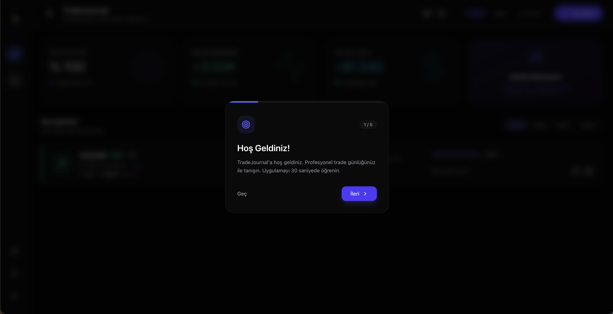
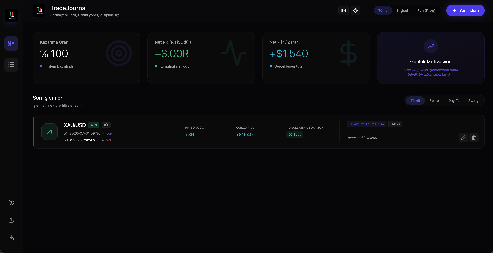
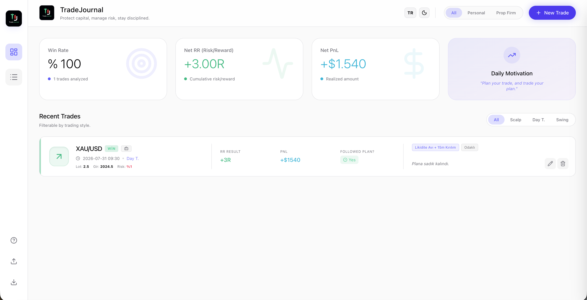
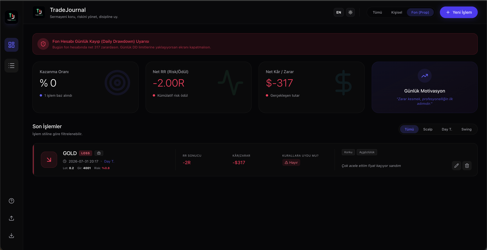
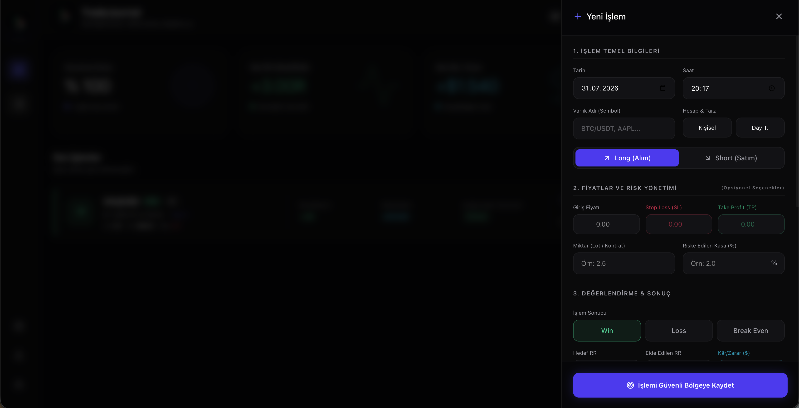
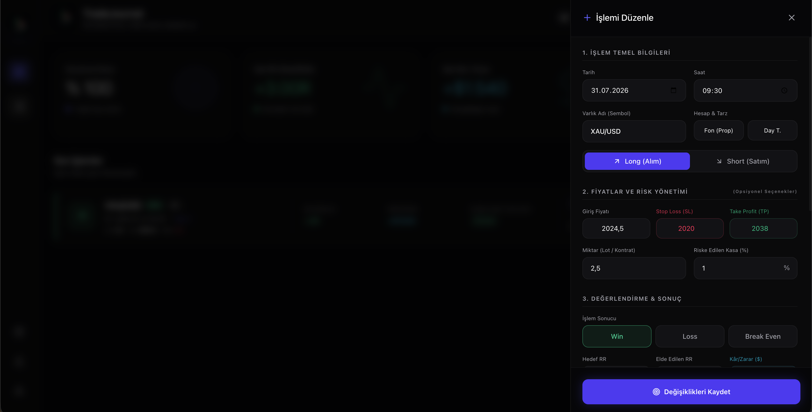
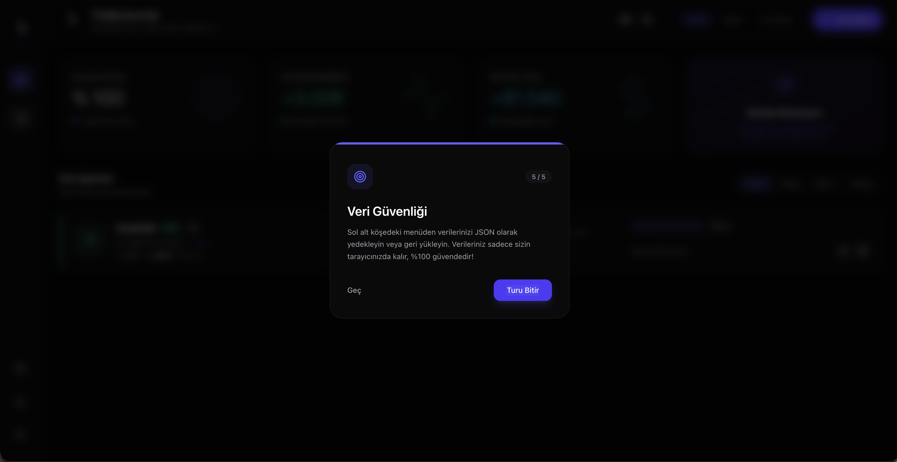
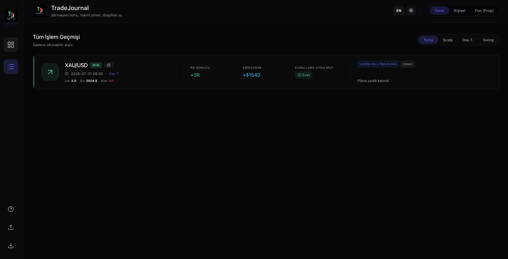

  

  # TradeJournal 🚀

  **Sermayeni koru, riskini yönet, disipline uy.**
  
  Profesyonel ve gelişmekte olan traderlar için tasarlanmış; tamamen tarayıcı üzerinde çalışan, güvenli ve modern bir işlem günlüğü (trade journal) web uygulaması.

  [Canlı Site](https://www.tradejournal.com.tr/)

---

## 📖 Proje Hakkında

Trade Journal, işlemlerinizi (trade) detaylı bir şekilde kayıt altına alıp performans metriklerinizi analiz edebileceğiniz kapsamlı bir araçtır. İster kişisel fonlarınızı, ister Prop Firm hesaplarınızı yönetin, ihtiyacınız olan tüm analitik veriler elinizin altındadır. Üstelik uygulamanın bir backend'i yoktur, verileriniz tamamen yerel cihazınızda saklanır.

### 🌟 Öne Çıkan Özellikler

*   **📊 Gelişmiş Analitik Dashboard:** Kazanma Oranı (Win Rate), Net RR (Risk/Ödül) ve Net Kâr/Zarar (PnL) durumunuzu gerçek zamanlı takip edin.
*   **📝 Kapsamlı İşlem Kaydı:** Giriş/Çıkış fiyatları, Stop Loss (SL), Take Profit (TP), Lot miktarı ve risk yüzdesi gibi detayları kaydedin.
*   **📂 Hesap ve Strateji Yönetimi:** İşlemlerinizi hesap tipine (Kişisel, Fon/Prop) ve trade stiline (Scalp, Day Trade, Swing) göre etiketleyip filtreleyin.
*   **🔒 %100 Veri Gizliliği:** Uygulama herhangi bir veritabanı (backend) kullanmaz. Tüm verileriniz tarayıcınızın `localStorage` alanında tutulur.
*   **💾 İçe/Dışa Aktarma (JSON):** İşlem geçmişinizi JSON dosyası olarak kolayca yedekleyin ve dilediğiniz zaman geri yükleyin.
*   **🌗 Modern Arayüz (UI/UX):** Aydınlık (Light) ve Karanlık (Dark) mod desteği ile göz yormayan, şık tasarım.

---

## 📸 Ekran Görüntüleri

*(Projenize ait ekran görüntülerini GitHub'da göstermek için görsellerinizi projedeki bir klasöre (örn. `public/screenshots/`) yükleyip aşağıdaki yolları güncelleyebilirsiniz)*

### İlk Tur

Görüntülemek için tıklayın

### Dashboard (Karanlık Tema)

  
Görüntülemek için tıklayın

  
  

### Dashboard (Aydınlık Tema)

  
Görüntülemek için tıklayın

  
  

### Prop Firm Drawdown Uyarısı

  
Görüntülemek için tıklayın

### Yeni İşlem Modalı

  
Görüntülemek için tıklayın

  
  

### İşlemi Düzenleme

  
Görüntülemek için tıklayın

  
  

### Veri Güvenliği ve Onboarding

  
Görüntülemek için tıklayın

  
  

### Salt Okunur

  
Görüntülemek için tıklayın

  
  

---

## 🛠️ Kullanılan Teknolojiler

*   **Framework:** [Next.js](https://nextjs.org/) (App Router)
*   **Kütüphane:** [React 19](https://react.dev/)
*   **Stil:** [Tailwind CSS v4](https://tailwindcss.com/)
*   **İkonlar:** [Lucide React](https://lucide.dev/)
*   **Dil:** [TypeScript](https://www.typescriptlang.org/)
*   **Hosting:** [Vercel](https://vercel.com/)
*   **Veritabanı:** Yok (Local Storage tabanlı)

---

## 🔒 Veri Güvenliği ve Gizlilik

TradeJournal, gizliliğinizi ön planda tutan bir mimariyle geliştirilmiştir. **Sistemde hiçbir backend (sunucu) veritabanı bulunmamaktadır.**

Tüm trade geçmişiniz, ayarlarınız ve analizleriniz yalnızca sizin bilgisayarınızda, tarayıcınızın `localStorage` belleğinde tutulur. Bu sayede:
- Verilerinize sizden başka hiç kimse (geliştirici dahil) erişemez.
- Üye girişi veya hesap oluşturma gibi adımlara gerek yoktur.
- Verilerinizi güvende tutmak için dilediğiniz an tek tıkla JSON formatında yedeğini alabilirsiniz.

---

  <i>"Zarar kesmek, profesyonelliğin ilk adımıdır."</i>

